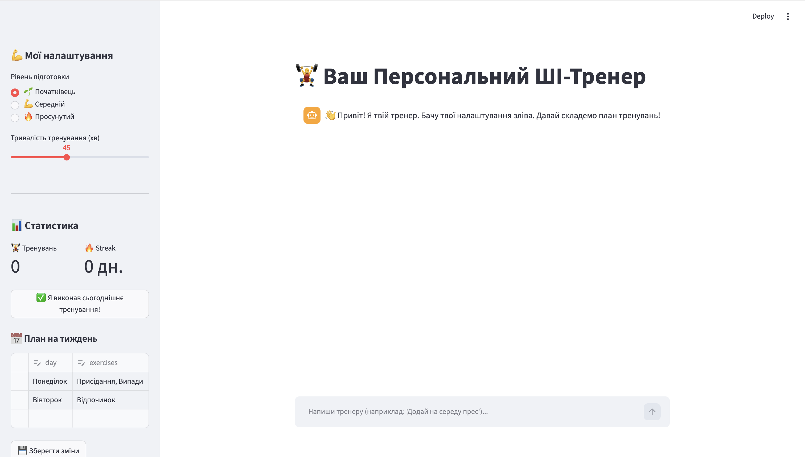
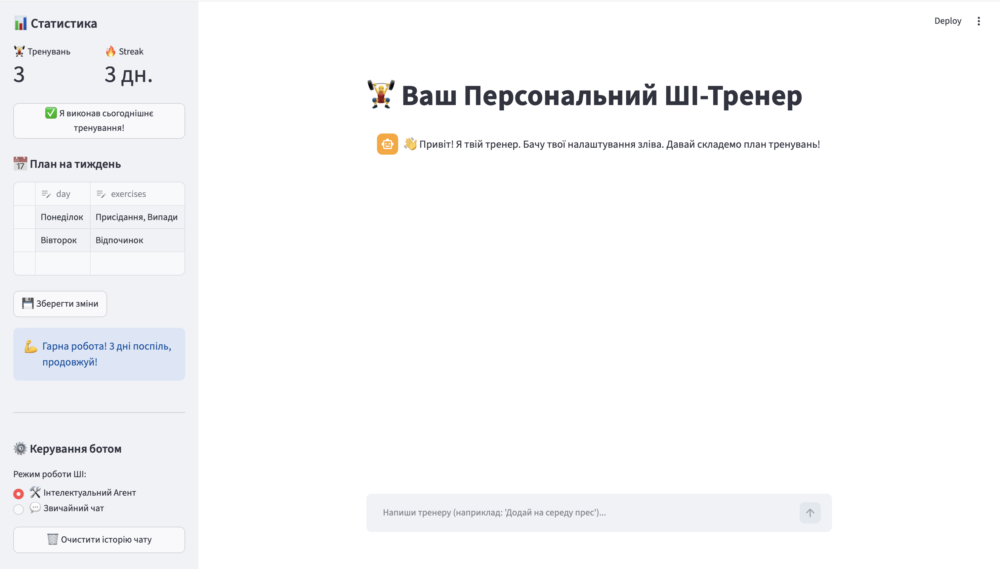
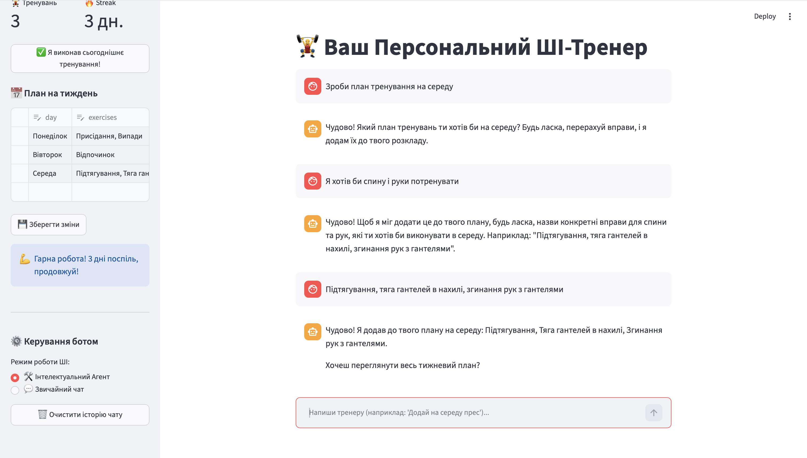

# 🏋️‍♂️ Фітнес-Асистент «WorkoutBot» (Streamlit & LangGraph)

Повноцінний інтелектуальний веб-застосунок для персонального фітнес-тренінгу, що поєднує можливості генеративного штучного інтелекту **Google Gemini** та гнучке керування логікою діалогу й базою даних за допомогою фреймворку **LangGraph**.

---

## 📝 1. Вибраний варіант та опис предметної області

**Варіант застосування:** Персональний ШІ-тренер (WorkoutBot).  
**Предметна область:** Фітнес, спорт, планування тренувань, відстеження активності та дисципліни користувача.

Сучасні атлети стикаються з проблемою хаотичного планування тренувань та втрати мотивації. **WorkoutBot** вирішує це, пропонуючи інтерактивний досвід спілкування з віртуальним тренером. Додаток не просто генерує шаблонні тексти, а виступає автономним агентом, який здатний розпізнавати наміри користувача, автоматично модифікувати та структурувати тижневий розклад тренувань, вести облік прогресу користувача у реальному часі та адаптувати складність вправ під індивідуальний профіль атлета.

---

## 🛠️ 2. Опис реалізованих функцій та UI-компонентів

### Ключовий функціонал (AI-можливості):
* **Автономний ReAct-Агент (LangGraph):** Аналізує запити користувача та самостійно вирішує, коли потрібно викликати вбудовані Python-інструменти для роботи з базою даних.
* **Динамічне керування розкладом:** Через інструмент `add_workout_day` бот розбирає текстові запити (наприклад, *"Додай на понеділок біг та планку"*) і автоматично вносить вправи у відповідний день.
* **Зчитування та підсумок:** Інструменти `get_workout_for_day` та `weekly_summary` дозволяють боту аналізувати поточний стан розкладу користувача та видавати структуровані звіти про спортивний план на тиждень.
* **Дворежимний інтерфейс (Dual Mode):** Можливість перемикання між розумним агентом (з доступом до інструментів планування) та звичайним LLM-чатом (для швидких консультацій, питань щодо дієтології та техніки виконання вправ).
* **Стрімінг відповідей:** Використання генераторів та прогресивного виводу тексту для звичайного чату, що забезпечує високу швидкість відгуку інтерфейсу (UX).

### Використані спеціалізовані UI-компоненти Streamlit:
1. `st.sidebar`: Візуально ізолює блок персональних налаштувань профілю від вікна діалогу.
2. `st.data_editor`: Інтерактивна таблиця, яка виводить тижневий план. Дозволяє користувачу редагувати вправи вручну, видаляти чи додавати рядки, з можливістю подальшої синхронізації із внутрішньою пам'яттю ШІ-агента за допомогою архітектури `InjectedState`.
3. `st.metric`: Компактні картки гейміфікації для виводу кількості завершених тренувань та лічильника днів безперервної дисципліни (`Streak`).
4. `st.chat_message` & `st.chat_input`: Сучасні нативні компоненти для побудови звичного та зручного чат-інтерфейсу з розподілом ролей користувача та асистента.
5. `st.spinner`: Анімований індикатор завантаження під час виконання агентом багатокрокових міркувань і виклику інструментів.
6. `st.toast` & `st.success`: Спливаючі сповіщення та інформаційні плашки для підбадьорювання атлета та виводу мотиваційних повідомлень залежно від тривалості його стріку.

---

## 📂 3. Структура файлів проєкту

```text
📁 workout-bot-streamlit/
├── 📁 .streamlit/
│   └── 📄 secrets.toml          # Локальні API-ключі (сховано від Git)
├── 📁 screenshots/              # Знімки екрана інтерфейсу програми
│   ├── 01_main_chat.png
│   ├── 02_sidebar_controls.png
│   └── 03_dialogue_example.png
├── 📄 .gitignore                # Файл виключення секретів та кешу (.venv, .DS_Store)
├── 📄 agent.py                  # Модуль побудови графа LangGraph та інструментів агента
├── 📄 app.py                    # Головний файл веб-інтерфейсу фреймворку Streamlit
└── 📄 requirements.txt          # Перелік залежностей проєкту та версій бібліотек
```

---


## 📸 4. Скріншоти інтерфейсу застосунку

### Головне вікно чату та знайомство з тренером


### Бічна панель налаштувань, статистика та мотиваційні плашки


### Приклад діалогу з агентом та виклику інструментів планування

